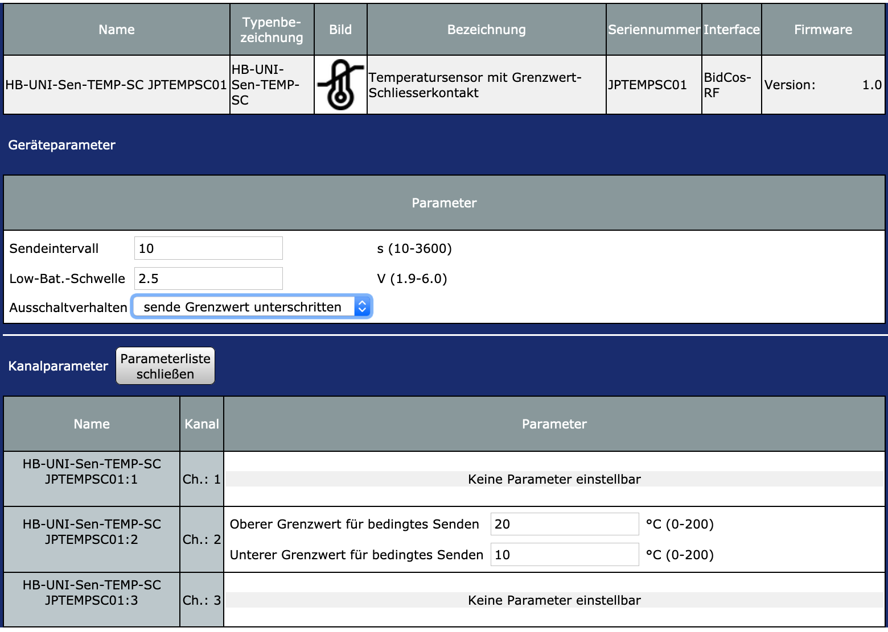

# HB-UNI-Sen-TEMP-SC
### universeller Temperatursensor (NTC) mit Grenzwertschalter

Da ich das Gerät nur bei Bedarf einschalten möchte, um Strom zu sparen (bei seltener Verwendung), habe ich eine kleine Selbsthalteschaltung gebaut.
Mit einem Taster lässt sich das Gerät ein- und ausschalten.
Der Einschaltzustand wird dabei an die WebUI übertragen.

Die Selbsthalteschaltung:

Prototyp:

